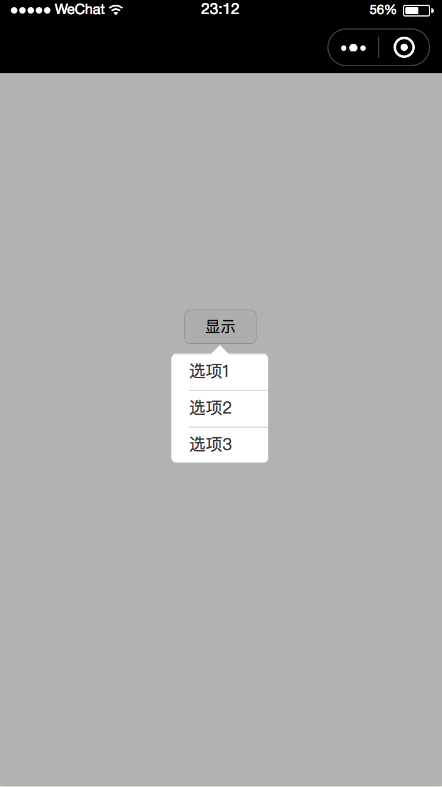
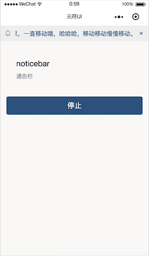
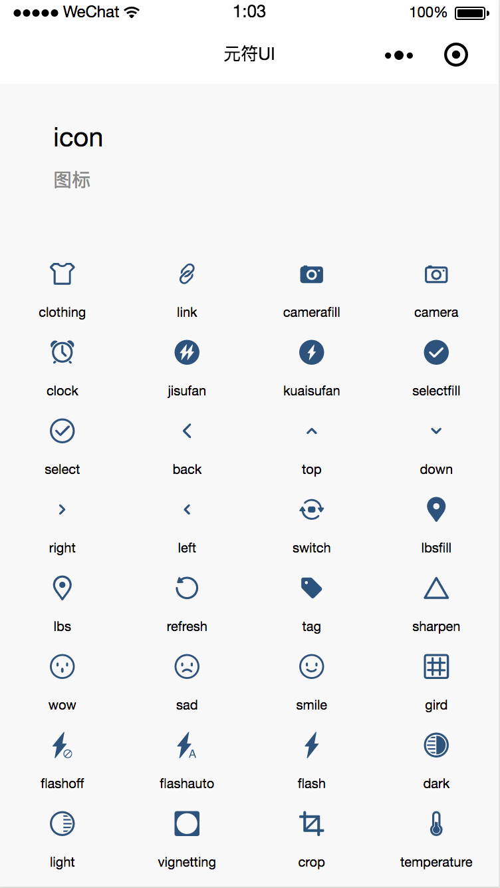
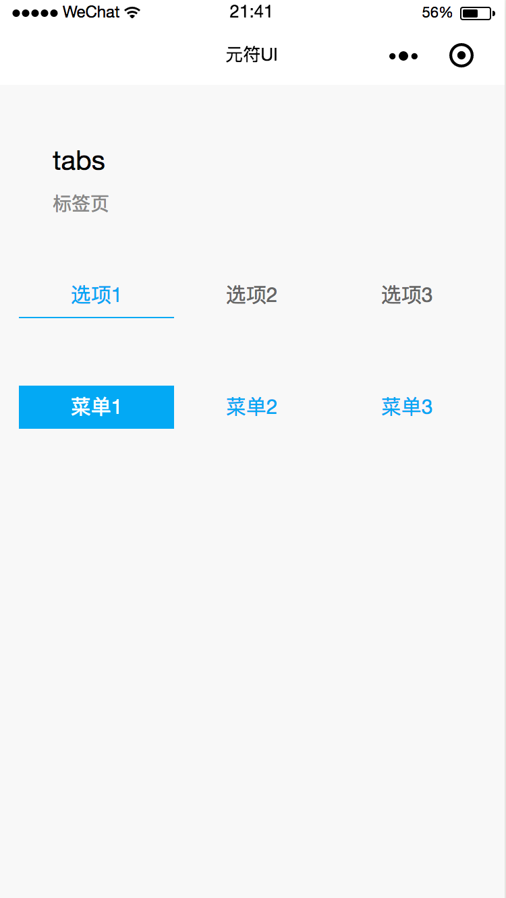
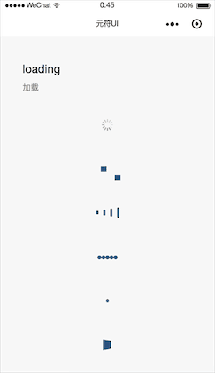
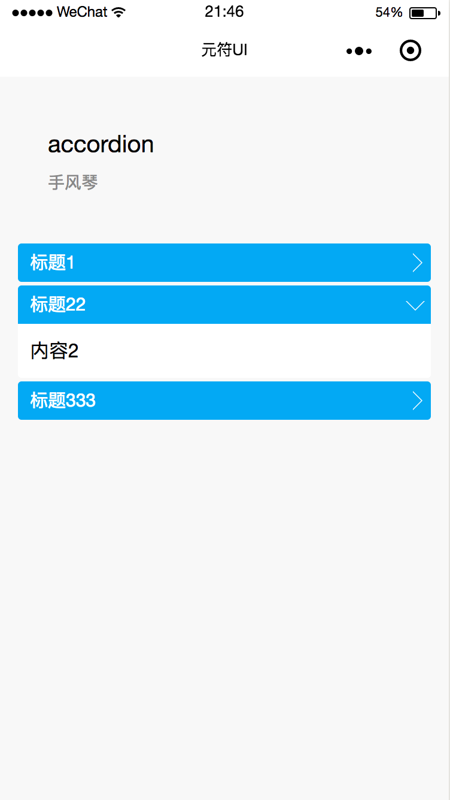

# yuanful-ui

<div align="center">
  
  <br>

  <p><strong>当前版本：1.0.2，持续更新中</strong></p>
  <p>这是一套可添加到小程序内直接使用的功能插件，无需重复开发，为用户提供更丰富的服务。</p>
  <p><strong>无需确认，申请后即可添加插件，免费使用。</strong></p>
</div>

## 备注
* 插件目录如果标注了`预览版`字样，则表示此版本的插件正在审核
* 如果您有什么问题，欢迎提到 [issues](https://github.com/yuanful/yuanful-ui/issues)，或者通过以下方式咨询反馈
* 如果您喜欢我们的插件，请点击右上角“star” :wink:
* 请参考使用案例源码 [yuanful-ui-demo](https://github.com/yuanful/yuanful-ui-demo)

## 联系方式
* 邮箱：org.java.tango@gmail.com
* QQ：278826466
* 网站：[元符科技](http://yuanful.com/index.html)


## 插件预览


## 插件安装
#### 1. 添加插件


#### 2. 配置插件
在`app.json`中配置插件的引入

```json
{
  "pages": [
    "pages/index/index"
  ],
  "plugins": {
    "YuanFul": {
      "version": "1.0.2",
      "provider": "wx2ca7a9c0f8d4e2b9"
    }
  }
}
```


## 插件目录
* [city-index-list 城市选择列表](#city-index-list)
* [searchbar 搜索栏](#searchbar)
* [calendar 日历选择](#calendar)
* [float-button 浮动按钮](#float-button)
* [popover 弹出菜单](#popover)
* [noticebar 通告栏](#noticebar)
* [icon 图标](#icon)（预览版）
* [tabs 标签页](#tabs)（预览版）
* [loading 加载](#loading)（预览版）
* [accordion 手风琴](#accordion)（预览版）


## 插件说明
#### 插件主题颜色值
*  blue `#03a9f4`
*  orange `#f19149`
*  red `#f44336`
*  green `#009688`

<details>
<summary id="city-index-list">
  city-index-list 城市选择列表 <code>>= v1.0.1</code>
</summary>

  ### 预览
  <div>
    
  </div>

  ### 属性
  名称 | 类型 | 默认 | 描述
  --- | --- | --- | ---
  theme   | String  | `blue`     | 插件主题<br/>支持：`orange`、`red`、`blue`、`green`
  styles  | Object  | `{}`        | 插件自定义样式，支持：<br/>`letterBarBackground` 字母索引背景色<br/>`letterColor` 字母默认颜色<br/>`letterActiveColor` 字母选中的颜色<br/>`closerBackground` 关闭按钮背景
  visible | Boolean | `false`     | 是否显示

  ### 事件
  名称 | 参数 | 描述
  --- | --- | ---
  select  | `event` | 选择城市的回调，`event.detail` 为选择的城市数据，包括：`name` 城市名、`code` 城市编码

  ### 使用
  page.json
  ```json
  {
    "usingComponents": {
      "city-index-list": "plugin://YuanFul/city-index-list"
    }
  }
  ```

  page.wxml
  ```html
  <city-index-list
      theme="orange"
      visible="{{cityVisible}}"
      styles="{{cityStyles}}"
      bind:select="onSelectCity"
  />

  <button bind:tap="onClickBtn">显示</button>
  ```

  page.js
  ```javascript
  Page({
      data: {
          cityVisible: false,
          cityStyles: {
              letterColor: '#fff'
          }
      },
      onClickBtn(){
          this.setData({
              cityVisible: true
          });
      },
      onSelectCity(e){
          let detail = e.detail;

          console.log(detail);
      }
  });
  ```
<br/>[⬆ 返回目录](#插件目录)
</details>


<details>
<summary id="searchbar">
  searchbar 搜索栏 <code>>= v1.0.1</code>
</summary>

  ### 预览
  <div>
    
  </div>

  ### 属性
  名称 | 类型 | 默认 | 描述
  --- | --- | --- | ---
  theme   | String  | `blue`     | 插件主题<br/>支持：`orange`、`red`、`blue`、`green`
  visible | Boolean | `false`     | 是否显示
  placeholder | String | `请输入关键字`     | 输入框默认占位文字
  search-value | String | ''     | 输入框默认值，默认为空
  clear-confirm | Boolean | `true`     | 点击清空是否弹出二次确认框
  confirm-config | Object | `{ content: '确定要清空吗？' }`     | 清空时二次确认弹窗配置，与`wx.showModal`参数一致

  ### 事件
  名称 | 参数 | 描述
  --- | --- | ---
  search  | `event` | 搜索的回调，`event.detail.text` 为搜索的文字
  cancel  | `event` | 取消的回调

  ### 使用
  page.json
  ```json
  {
    "usingComponents": {
      "searchbar": "plugin://YuanFul/searchbar"
    }
  }
  ```

  page.wxml
  ```html
  <searchbar
    visible="{{searchbarVisible}}"
    search-value="测试"
    confirm-config="{{confirmConfig}}"
    clear-confirm="{{true}}"
    bind:search="onSearch"
  />

  <button bind:tap="onClickBtn">显示</button>
  ```

  page.js
  ```javascript
    Page({
        data: {
        confirmConfig: {
            content: '确定要清空内容吗？'
        }
        },
        onClickBtn() {
            this.setData({
                searchbarVisible: true
            });
        },
        onSearch(e) {
            let detail = e.detail;

            console.log(detail);
        }
    });
  ```
<br/>[⬆ 返回目录](#插件目录)
</details>


<details>
<summary id="calendar">
  calendar 日历选择 <code>>= v1.0.2</code>
</summary>

  ### 预览
  <div>
    
  </div>

  ### 属性
  名称 | 类型 | 默认 | 描述
  --- | --- | --- | ---
  theme   | String  | `blue`     | 插件主题<br/>支持：`orange`、`red`、`blue`、`green`
  visible | Boolean | `false`     | 是否显示
  start-date | String | ''     | 开始日期，必填
  end-date | String | ''     | 结束日期，必填

  ### 事件
  名称 | 参数 | 描述
  --- | --- | ---
  change  | `event` | 选中日期的回调，`event.detail.currentDate` 为选中的日期

  ### 使用
  page.json
  ```json
  {
    "usingComponents": {
      "calendar": "plugin://YuanFul/calendar"
    }
  }
  ```

  page.wxml
  ```html
    <calendar
        visible="{{calendarVisible}}"
        start-date="2017-07-07"
        end-date="2018-08-08"
        bind:change="onChangeDate"
    />

    <button bind:tap="onClickBtn">显示</button>
  ```

  page.js
  ```javascript
    Page({
        data: {
            calendarVisible: false
        },
        onLoad() {

        },
        onClickBtn() {
            this.setData({
                calendarVisible: true
            });
        },
        onChangeDate(e) {
            let detail = e.detail;

            console.log(detail);
        }
    });
  ```
<br/>[⬆ 返回目录](#插件目录)
</details>


<details>
<summary id="float-button">
  float-button 浮动按钮 <code>>= v1.0.2</code>
</summary>

  ### 预览
  <div>
    
    
  </div>

  ### 属性
  名称 | 类型 | 默认 | 描述
  --- | --- | --- | ---
  theme   | String  | `blue`     | 插件主题<br/>支持：`orange`、`red`、`blue`、`green`
  visible | Boolean | `true`     | 是否显示，默认显示
  src | String | `[如图-左]`     | 默认图片
  active-src | String | `[如图-右]`     | 点击之后的图片

  ### 事件
  名称 | 参数 | 描述
  --- | --- | ---
  tapfloat  | `event` | 选中日期的回调，`event.detail.open` 开关状态

  ### 使用
  page.json
  ```json
  {
    "usingComponents": {
      "float-button": "plugin://YuanFul/float-button"
    }
  }
  ```

  page.wxml
  ```html
    <float-button
        bind:tapfloat="onTapBtn"
    />
  ```

  page.js
  ```javascript
    Page({
        data: {

        },
        onTapBtn(e) {
            let detail = e.detail;

            console.log(detail);
        }
    })
  ```
<br/>[⬆ 返回目录](#插件目录)
</details>


<details>
<summary id="popover">
  popover 弹出菜单 <code>>= v1.0.2</code>
</summary>

  ### 预览
  <div>
    
  </div>

  ### 属性
  名称 | 类型 | 默认 | 描述
  --- | --- | --- | ---
  visible | Boolean | `false`     | 是否显示
  list | Array | `[]`     | 菜单配置
  elem-rect | Object | `{}`     | 元素的坐标信息
  page-rect | Object | `{}`     | 页面的坐标信息
  dir | String | `auto`     | 箭头方位，默认自动计算<br/>如果传入的方位不支持，那么使用默认第一个支持的<br/>可选值`tl tc tr rt rc rb bl bc br lt lc lb`<br/>分别代表上右下左中，组合而成的12个方位：<br/>`tl` 对应 `top-left`<br/>`tc` 对应 `top-center`<br/>`tr` 对应 `top-right`<br/>`rt` 对应 `right-top`<br/>`rc` 对应 `right-center`<br/>`rb` 对应 `right-bottom`<br/>`bl` 对应 `bottom-left`<br/>`bc` 对应 `bottom-center`<br/>`br` 对应 `bottom-right`<br/>`lt` 对应 `left-top`<br/>`lc` 对应 `left-center`<br/>`lb` 对应 `left-bottom`

  ### 事件
  名称 | 参数 | 描述
  --- | --- | ---
  select  | `event` | 选中菜单的回调，`event.detail.item` 当前选中的菜单项

  ### 使用
  page.json
  ```json
  {
    "usingComponents": {
      "popover": "plugin://YuanFul/popover"
    }
  }
  ```

  page.wxml
  ```html
    <popover
        dir="tc"
        list="{{list}}"
        elem-rect="{{elemRect}}"
        page-rect="{{pageRect}}"
        visible="{{visible}}"
        bind:select="onSelectPopover"
    />

    <view class=".page">
        <button id="menuBtn" size="mini" bind:tap="onClickBtn">显示</button>
    </view>
  ```

  page.js

  **注意：** 每个页面必须调用下面的`initPopover`方法。`elemSelector`就是按钮的选择器，`pageSelector`就是页面最外层的选择器。并设置组件的属性`elem-rect`、`page-rect`
  ```javascript
    Page({
        data: {
            visible: false,
            list: ['选项1', '选项2', '选项3']
        },
        onReady(){
            this.initPopover();
        },
        // 每个页面必须
        initPopover() {
            let elemSelector = '#menuBtn';
            let pageSelector = '.page';
            
            wx.createSelectorQuery()
                .select(elemSelector)
                .boundingClientRect((res) => {
                    this.setData({
                        elemRect: res
                    });
                }).exec();

            let getRect = (callback) => {
                wx.createSelectorQuery()
                    .select(pageSelector)
                    .boundingClientRect((rect) => {
                        if (rect) {
                            callback(rect);
                        } else {
                            setTimeout(() => getRect(callback), 100);
                        }
                    }).exec();
            }

            getRect((res) => {
                this.setData({
                    pageRect: res
                });
            });
        },
        onSelectPopover(event) {
            console.log(event.detail.item);
        },
        onClickBtn() {
            this.setData({
                visible: true
            });
        },
    })
  ```
<br/>[⬆ 返回目录](#插件目录)
</details>


<details>
<summary id="noticebar">
  noticebar 通告栏 <code>>= v1.0.2</code>
</summary>

  ### 预览
  <div>
    
  </div>

  ### 属性
  名称 | 类型 | 默认 | 描述
  --- | --- | --- | ---
  visible | Boolean | `false`     | 是否显示
  content | String | ''     | 文案内容
  animation | Boolean | `true`     | 是否滚动
  show-closer | Boolean | `true`     | 是否显示关闭按钮
  font-size | String | `30rpx`     | 文字大小
  duration | String | `5s`     | 动画时长，与CSS3的`animation-duration`相同
  icon | String | `[如图]`     | 左边图标（图片地址）
  styles | Object | `{}`     | 插件自定义样式，支持：<br/>`backgroundColor` 通告栏背景色<br/>`contentColor` 内容文字颜色<br/>`closerColor` 关闭按钮颜色

  ### 事件
  名称 | 参数 | 描述
  --- | --- | ---
  tapbar  | `event` | 点击的回调
  close  | `event` | 关闭的回调

  ### 使用
  page.json
  ```json
  {
    "usingComponents": {
      "noticebar": "plugin://YuanFul/noticebar"
    }
  }
  ```

  page.wxml
  ```html
    <noticebar
        content="{{content}}"
        show-closer="{{showCloser}}"
        styles="{{styles}}"
        bind:tapbar="onTapBar"
    />
  ```

  page.js
  ```javascript
    Page({
        data: {
            showCloser: true,
            content: '这是一个跑马灯效果，一直移动哦，哈哈哈，移动移动慢慢移动。',
            styles: {
                // backgroundColor: '#eee',
                // closerColor: 'red',
                // contentColor: 'red',
            }
        },
        onTapBar() {
            console.log('tap')
        },
    })
  ```
<br/>[⬆ 返回目录](#插件目录)
</details>


<details>
<summary id="icon">
  icon 图标 <code>>= v1.0.3</code>
</summary>

  ### 预览
  <div>
    
  </div>

  ### 属性
  名称 | 类型 | 默认 | 描述
  --- | --- | --- | ---
  theme   | String  | `blue`     | 插件主题<br/>支持：`orange`、`red`、`blue`、`green`
  icon | String | ''     | 图标类型
  size | String | `40rpx`     | 图标大小
  color | String | ''     | 图标颜色，默认theme主题色

  ### 事件
  名称 | 参数 | 描述
  --- | --- | ---
  tapicon  | `event` | 点击图标的事件，`event.detail.icon`为点击图标的类型
  ### 使用
  page.json
  ```json
  {
    "usingComponents": {
      "yf-icon": "plugin://YuanFul/icon"
    }
  }
  ```

  page.wxml
  ```html
    <yf-icon
        theme="deep-blue"
        icon="shouye"
        size="50rpx"
        bind:tapicon="tapicon"
    />
  ```

  page.js
  ```javascript
    Page({
        tapicon(event){
            console.log(event.detail)
        }
    })
  ```
<br/>[⬆ 返回目录](#插件目录)
</details>


<details>
<summary id="tabs">
  tabs 标签页 <code>>= v1.0.3</code>
</summary>

  ### 预览
  <div>
    
  </div>

  ### 属性
  名称 | 类型 | 默认 | 描述
  --- | --- | --- | ---
  theme   | String  | `blue`     | 插件主题<br/>支持：`orange`、`red`、`blue`、`green`
  themetype | String | `border`     | 风格，支持`border`、`background`两种类型（如图）
  vertical | Boolean | `false`     | 是否是垂直
  list | Array | `[]`     | 标题配置
  active-index | Number | `0`     | 默认激活位置

  ### 事件
  名称 | 参数 | 描述
  --- | --- | ---
  change  | `event` | 切换标签的事件，`event.detail.activeIndex` 为选择的索引

  ### 使用
  page.json
  ```json
  {
    "usingComponents": {
      "tabs": "plugin://YuanFul/tabs"
    }
  }
  ```

  page.wxml
  ```html
    <tabs
        theme="deep-blue"
        list="{{ list }}"
        bind:change="onTabChange"
    />
  ```

  page.js
  ```javascript
    Page({
        data: {
            list: ['选项1', '选项2', '选项3'],
        },
        onTabChange(event) {
            console.log(event.detail)
        }
    })
  ```
<br/>[⬆ 返回目录](#插件目录)
</details>


<details>
<summary id="loading">
  loading 加载 <code>>= v1.0.3</code>
</summary>

  ### 预览
  <div>
    
  </div>

  ### 属性
  名称 | 类型 | 默认 | 描述
  --- | --- | --- | ---
  theme   | String  | `blue`     | 插件主题<br/>支持：`orange`、`red`、`blue`、`green`
  visible | Boolean | `true`     | 是否显示
  type | String | `default`     | 加载动画类型
  modal | Boolean | `false`     | 是否是遮罩类型

  ### 使用
  page.json
  ```json
  {
    "usingComponents": {
      "loading": "plugin://YuanFul/loading"
    }
  }
  ```

  page.wxml
  ```html
    <loading
        type="default"
    />
  ```
<br/>[⬆ 返回目录](#插件目录)
</details>


<details>
<summary id="accordion">
  accordion 手风琴 <code>>= v1.0.3</code>
</summary>

  ### 预览
  <div>
    
  </div>

  ### 属性
  名称 | 类型 | 默认 | 描述
  --- | --- | --- | ---
  theme   | String  | `blue`     | 插件主题<br/>支持：`orange`、`red`、`blue`、`green`
  slotname | String | `accordion`     | 手风琴`slot`的名称前缀
  list | Array | `[]`     | 标题配置
  active-index | Number | `-1`     | 默认展开的索引（-1表示默认不展开）

  ### 事件
  名称 | 参数 | 描述
  --- | --- | ---
  change  | `event` | 展开的事件，`event.detail.activeIndex` 为展开的索引

  ### 使用
  page.json
  ```json
  {
    "usingComponents": {
      "accordion": "plugin://YuanFul/accordion"
    }
  }
  ```

  page.wxml
  ```html
    <accordion
        theme="deep-blue"
        list="{{list}}"
        bind:change="onChangeDate"
    >
        <view slot="accordion0">内容1</view>
        <view slot="accordion1">内容2</view>
        <view slot="accordion2">内容3</view>
    </accordion>
  ```

  page.js
  ```javascript
    Page({
        data: {
            list: [
                '标题1',
                '标题22',
                '标题333',
            ]
        },
        onChangeDate(e) {
            let detail = e.detail;

            console.log(detail);
            this.setData({
                result: detail.currentDate
            });
        }
    });
  ```
<br/>[⬆ 返回目录](#插件目录)
</details>