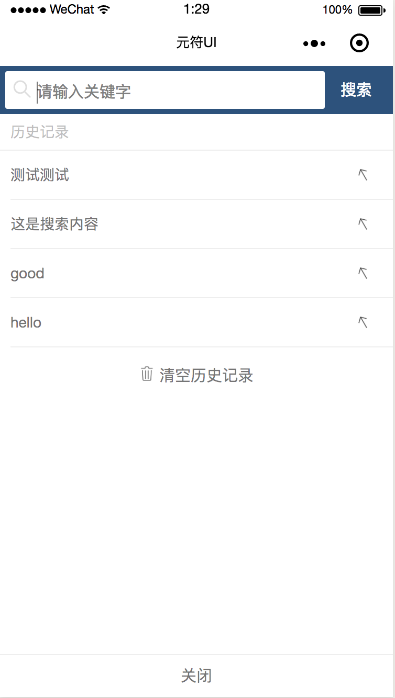
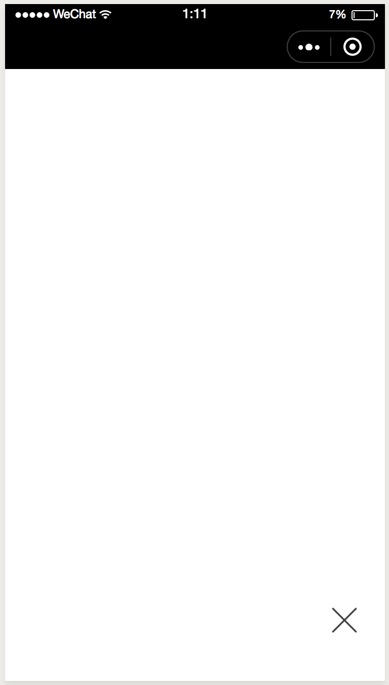

# yuanful-ui

<div align="center">
  
  <br>

  <p><strong>持续更新中</strong></p>
  <p>yuanful-ui是一套可添加到小程序内直接使用的功能组件，无需重复开发，为用户提供更丰富的服务。<strong>无需确认，申请后即可添加插件，免费使用。</strong></p>
</div>

## 说明
* 插件目录中标注了`下个版本`的文字，表示此版本无法使用，下个版本将会出现
* 如果您有什么问题，欢迎提到[issues](https://github.com/yuanful/yuanful-ui/issues)，或者通过以下方式咨询联系


## 联系方式
* 邮箱：org.java.tango@gmail.com
* QQ：278826466
* 网站：[元符科技](http://yuanful.com/index.html)


## 插件安装
#### 1. 添加插件


#### 2. 配置插件
在`app.json`中配置插件的引入

```json
{
  "pages": [
    "pages/index/index"
  ],
  "plugins": {
    "YuanFul": {
      "version": "1.0.1",
      "provider": "wx2ca7a9c0f8d4e2b9"
    }
  }
}
```


## 插件目录
* [城市选择列表 city-index-list](#city-index-list)
* [搜索组件 searchbar](#searchbar)
* [日历选择 calendar](#calendar)（下个版本）
* [浮动按钮 float-button](#float-button)（下个版本）


## 插件说明
#### 插件主题颜色值
*  blue `#03a9f4`
*  orange `#f19149`
*  red `#f44336`
*  green `#009688`

<details>
<summary id="city-index-list">
城市选择列表 city-index-list
</summary>

  ### 预览
  <div>
    
  </div>

  ### 属性
  名称 | 类型 | 默认 | 描述
  --- | --- | --- | ---
  theme   | String  | `blue`     | 插件主题<br/>支持：`orange`、`red`、`blue`、`green`
  styles  | Object  | `{}`        | 插件自定义样式<br/>支持：`letterBarBackground` 字母索引背景色、`letterColor` 字母默认颜色、`letterActiveColor` 字母选中的颜色、`closerBackground` 关闭按钮背景
  visible | Boolean | `false`     | 是否显示

  ### 事件
  名称 | 参数 | 描述
  --- | --- | ---
  select  | `event` | 选择城市的回调，`event.detail` 为选择的城市数据，包括：`name` 城市名、`code` 城市编码

  ### 使用
  page.json
  ```json
  {
    "usingComponents": {
      "city-index-list": "plugin://YuanFul/city-index-list"
    }
  }
  ```

  page.wxml
  ```html
  <city-index-list
      theme="orange"
      visible="{{cityVisible}}"
      styles="{{cityStyles}}"
      bind:select="onSelectCity"
  />

  <button bind:tap="onClickBtn">显示</button>
  ```

  page.js
  ```javascript
  Page({
      data: {
          cityVisible: false,
          cityStyles: {
              letterColor: '#fff'
          }
      },
      onClickBtn(){
          this.setData({
              cityVisible: true
          });
      },
      onSelectCity(e){
          let detail = e.detail;

          console.log(detail);
      }
  });
  ```
<br/>[⬆ 返回目录](#插件目录)
</details>


<details>
<summary id="searchbar">
  搜索组件 searchbar
</summary>

  ### 预览
  <div>
    
  </div>

  ### 属性
  名称 | 类型 | 默认 | 描述
  --- | --- | --- | ---
  theme   | String  | `blue`     | 插件主题<br/>支持：`orange`、`red`、`blue`、`green`
  visible | Boolean | `false`     | 是否显示
  placeholder | String | `请输入关键字`     | 输入框默认占位文字
  search-value | String | ``     | 输入框默认值，默认为空
  clear-confirm | Boolean | `true`     | 点击清空是否弹出二次确认框
  confirm-config | Object | `{ content: '确定要清空吗？' }`     | 清空时二次确认弹窗配置，与`wx.showModal`参数一致

  ### 事件
  名称 | 参数 | 描述
  --- | --- | ---
  search  | `event` | 搜索的回调，`event.detail.text` 为搜索的文字
  cancel  | `event` | 取消的回调

  ### 使用
  page.json
  ```json
  {
    "usingComponents": {
      "searchbar": "plugin://YuanFul/searchbar"
    }
  }
  ```

  page.wxml
  ```html
  <searchbar
    visible="{{searchbarVisible}}"
    search-value="测试"
    confirm-config="{{confirmConfig}}"
    clear-confirm="{{true}}"
    bind:search="onSearch"
  />

  <button bind:tap="onClickBtn">显示</button>
  ```

  page.js
  ```javascript
    Page({
        data: {
        confirmConfig: {
            content: '确定要清空内容吗？'
        }
        },
        onClickBtn() {
            this.setData({
                searchbarVisible: true
            });
        },
        onSearch(e) {
            let detail = e.detail;

            console.log(detail);
        }
    });
  ```
<br/>[⬆ 返回目录](#插件目录)
</details>


<details>
<summary id="calendar">
  日历选择 calendar
</summary>

  ### 预览
  <div>
    
  </div>

  ### 属性
  名称 | 类型 | 默认 | 描述
  --- | --- | --- | ---
  theme   | String  | `blue`     | 插件主题<br/>支持：`orange`、`red`、`blue`、`green`
  visible | Boolean | `false`     | 是否显示
  start-date | String | ``     | 开始日期
  end-date | String | ``     | 结束日期

  ### 事件
  名称 | 参数 | 描述
  --- | --- | ---
  change  | `event` | 选中日期的回调，`event.detail.currentDate` 为选中的日期

  ### 使用
  page.json
  ```json
  {
    "usingComponents": {
      "calendar": "plugin://YuanFul/calendar"
    }
  }
  ```

  page.wxml
  ```html
    <calendar
        visible="{{calendarVisible}}"
        start-date="2017-07-07"
        end-date="2018-08-08"
        bind:change="onChangeDate"
    />

    <button bind:tap="onClickBtn">显示</button>
  ```

  page.js
  ```javascript
    Page({
        data: {
            calendarVisible: false
        },
        onLoad() {

        },
        onClickBtn() {
            this.setData({
                calendarVisible: true
            });
        },
        onChangeDate(e) {
            let detail = e.detail;

            console.log(detail);
        }
    });
  ```
<br/>[⬆ 返回目录](#插件目录)
</details>


<details>
<summary id="float-button">
  浮动按钮 float-button
</summary>

  ### 预览
  <div>
    
    
  </div>

  ### 属性
  名称 | 类型 | 默认 | 描述
  --- | --- | --- | ---
  theme   | String  | `blue`     | 插件主题<br/>支持：`orange`、`red`、`blue`、`green`
  visible | Boolean | `true`     | 是否显示，默认显示
  src | String | `[如图-左]`     | 默认图片
  active-src | String | `[如图-右]`     | 点击之后的图片

  ### 事件
  名称 | 参数 | 描述
  --- | --- | ---
  tapfloat  | `event` | 选中日期的回调，`event.detail.open` 开关状态

  ### 使用
  page.json
  ```json
  {
    "usingComponents": {
      "float-button": "plugin://YuanFul/float-button"
    }
  }
  ```

  page.wxml
  ```html
    <float-button
        bind:tapfloat="onTapBtn"
    />
  ```

  page.js
  ```javascript
    Page({
        data: {

        },
        onTapBtn(e) {
            let detail = e.detail;

            console.log(detail);
        }
    })
  ```
<br/>[⬆ 返回目录](#插件目录)
</details>